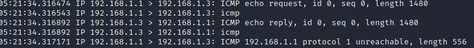

<div id="top"></div>


<!-- PROJECT LOGO -->
<br />
<div align="center">
    
  <h2 align="center">TP 2</h2>
  <h3 align="center">Attaques actives</h3>
</div>


<!-- TABLE OF CONTENTS -->

  <summary>Table of Contents</summary>
  <ol>
   <li><a href="#Objectifs-de-ce-TP">Objectifs de ce TP</a></li>
   <li><a href="#Outils-logiciels">Outils logiciels</a></li>
      <li>
        <a href="#Implémentation-attaques">Implémentation d’attaques</a>
           <ul>
              <li><a href="#Exercice-1">Exercice 1 : my_ping.c</a></li>
              <li><a href="#Exercice-2">Exercise 2 : pingsur2frag.c</a></li>
              <li><a href="#Exercice-3">Exercice 3 : pingfragments.c</a></li>
              <li><a href="#Exercice-4">Exercice 4 : demandeconntcp.c</a></li>
           </ul>
        </li>
    <li><a href="#Test-de-quelques-outils">Test de quelques outils d’attaques</a></li>
   </ol>

# Les attaques actives

> Les attaques actives sont mises en place par l’injection, la modification ou la suppression de
> paquets. L’attaquant peut ainsi laisser les traces des attaques qu’il lance. Ces traces peuvent
> être exploitées par l’administrateur réseau pour déceler l’existence d’attaques et identifier
> l’attaquant si possible. 


# Objectifs-de-ce-TP
> - Implémenter quelques attaques et les tester
> - Mise en place de quelques attaques en utilisant des outils d’attaques

# Outils-logiciels
> - Linux, 
> - wireshark ou ethereal, 
> - utilitaire ARPflood, 
> - utilitaire dhcpstarv, 
> - logiciel “cat Karat packet
builder”

# Implémentation-attaques

> Vous trouvez avec le présent fichier, les 4 exercices ci-dessous déjà mis sous forme de
> programmes C. (`pingfragments.c`, `pingsur2frag.c` ,`demandeconntcp.`c , `my_ping.c`)
> Vous pouvez compiler ces programmes sous un interpréteur de commandes shell unix en
> utilisant le compilateur cc ou gcc.
> 
> Exemple :
> - `cc -c my_ping.c`  pour compiler
> - `cc my_ping.c –o myping`  pour générer l’exécutable
> - `./myping 127.0.0.1 127.0.0.1 500`  pour envoyer un paquet de taille 528
> octets=500+20+8

# Exercice-1

Ce premier programme concerne un paquet IP encapsulant un paquet ICMP echo. Il s’agit
d’envoyer un paquet ICMP echo d’une machine A en donnant comme adresse destination
celle de B et comme adresse source celle de C. Vous devez observez en utilisant un sniffer
(ethereal ou tcpdump) un paquet icmp echo et sa réponse transmise de la machine B vers la
machine C. Avec ce premier exercice vous serez donc capable de générer un paquet IP et donc
de maîtriser parfaitement les différents champs de IP


<div align="center">
    
</div>

<div align="center">
    
</div>

<p align="right">(<a href="#top">back to top</a>)</p>


# Exercice-2
Le deuxième exercice consiste à concevoir deux fragments de paquet IP contenant à eux deux
un paquet ICMP echo avec les mêmes types d’adresses que l’exercice précédent. Cet exercice
vous permet de bien maîtriser la conception de fragments IP, ce qui est nécessaire pour
l’attaque Teardrop. Vous remarquerez dans cette exercice que pour l’offset on fait un décalage
de trois bits ….Dans le cas on vous ne comprenez ce calcul. Il vous est demander de faire un
ping avec une taille de 2000 octets sur le lien ethernet et avec le sniffer vous analyserez les
différents champs des fragments IP ainsi générés.

<div align="center">
    
</div>

<div align="center">
    
</div>

<p align="right">(<a href="#top">back to top</a>)</p>

# Exercice-3

<div align="center">
    
</div>

<div align="center">
    
</div>

<p align="right">(<a href="#top">back to top</a>)</p>

# Exercice-4

<div align="center">
    
</div>

<div align="center">
    
</div>

<p align="right">(<a href="#top">back to top</a>)</p>


## Test-de-quelques-outils

Dhcp starv :

> DHCP configuration:

`sudo nano /etc/dhcp/dhcpd.conf`

```sh

authoritative;
default-lease-time 600;
max-lease-time 7200;

subnet 192.168.1.0 netmask 255.255.255.0
{
        range 192.168.1.50 192.168.1.80;
        option routers 192.168.1.1;
        interface eth1;
}

```
 `sudo nano /etc/network/interfaces`

```sh
auto lo
iface lo inet loopback

allow-hotplug eth1
iface eth1 inet static
        address 192.168.1.1
        gateway 192.168.1.1
```
<p align="right">(<a href="#top">back to top</a>)</p>


Out Team - [AIT EL KADI Ilyas](https://github.com/IlyasKadi) - [AZIZ Oussama](https://github.com/ATAMAN0) - [BENCHEDI Yahia](https://github.com/Ben776ya)

Project Link: [https://github.com/IlyasKadi/Attaques_passives--sniffing_passif](https://github.com/IlyasKadi/Attaques_passives--sniffing_passif)

<p align="right">(<a href="#top">back to top</a>)</p>
