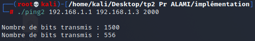

<div id="top"></div>


<!-- PROJECT LOGO -->
<br />
<div align="center">
    
  <h2 align="center">TP 2</h2>
  <h3 align="center">Attaques actives</h3>
</div>


<!-- TABLE OF CONTENTS -->

  <summary>Table of Contents</summary>
  <ol>
   <li><a href="#Objectifs-de-ce-TP">Objectifs de ce TP</a></li>
   <li><a href="#Outils-logiciels">Outils logiciels</a></li>
      <li>
        <a href="#Implémentation-attaques">Implémentation d’attaques</a>
           <ul>
              <li><a href="#Exercice-1">Exercice 1 : my_ping.c</a></li>
              <li><a href="#Exercice-2">Exercise 2 : pingsur2frag.c</a></li>
              <li><a href="#Exercice-3">Exercice 3 : pingfragments.c</a></li>
              <li><a href="#Exercice-4">Exercice 4 : demandeconntcp.c</a></li>
           </ul>
        </li>
    <li><a href="#Test-de-quelques-outils">Test de quelques outils d’attaques</a></li>
   </ol>

# Les attaques actives

> Les attaques actives sont mises en place par l’injection, la modification ou la suppression de
> paquets. L’attaquant peut ainsi laisser les traces des attaques qu’il lance. Ces traces peuvent
> être exploitées par l’administrateur réseau pour déceler l’existence d’attaques et identifier
> l’attaquant si possible. 


# Objectifs-de-ce-TP
> - Implémenter quelques attaques et les tester
> - Mise en place de quelques attaques en utilisant des outils d’attaques

# Outils-logiciels
> - Linux, 
> - wireshark ou ethereal, 
> - utilitaire ARPflood, 
> - utilitaire dhcpstarv, 
> - logiciel “cat Karat packet
builder”

# Implémentation-attaques

> Vous trouvez avec le présent fichier, les 4 exercices ci-dessous déjà mis sous forme de
> programmes C. (`pingfragments.c`, `pingsur2frag.c` ,`demandeconntcp.`c , `my_ping.c`)
> Vous pouvez compiler ces programmes sous un interpréteur de commandes shell unix en
> utilisant le compilateur cc ou gcc.
> 
> Exemple :
> - `cc -c my_ping.c`  pour compiler
> - `cc my_ping.c –o myping`  pour générer l’exécutable
> - `./myping 127.0.0.1 127.0.0.1 500`  pour envoyer un paquet de taille 528
> octets=500+20+8

# Exercice-1

Ce premier programme concerne un paquet IP encapsulant un paquet ICMP echo. Il s’agit
d’envoyer un paquet ICMP echo d’une machine A en donnant comme adresse destination
celle de B et comme adresse source celle de C. Vous devez observez en utilisant un sniffer
(ethereal ou tcpdump) un paquet icmp echo et sa réponse transmise de la machine B vers la
machine C. Avec ce premier exercice vous serez donc capable de générer un paquet IP et donc
de maîtriser parfaitement les différents champs de IP


<div align="center">
    
</div>

<div align="center">
    
</div>

<p align="right">(<a href="#top">back to top</a>)</p>


# Exercice-2
Le deuxième exercice consiste à concevoir deux fragments de paquet IP contenant à eux deux
un paquet ICMP echo avec les mêmes types d’adresses que l’exercice précédent. Cet exercice
vous permet de bien maîtriser la conception de fragments IP, ce qui est nécessaire pour
l’attaque Teardrop. Vous remarquerez dans cette exercice que pour l’offset on fait un décalage
de trois bits ….Dans le cas on vous ne comprenez ce calcul. Il vous est demander de faire un
ping avec une taille de 2000 octets sur le lien ethernet et avec le sniffer vous analyserez les
différents champs des fragments IP ainsi générés.

<div align="center">
    
</div>

<div align="center">
    
</div>

<p align="right">(<a href="#top">back to top</a>)</p>

# Exercice-3

<div align="center">
    
</div>

<div align="center">
    
</div>

<p align="right">(<a href="#top">back to top</a>)</p>

# Exercice-4

<div align="center">
    
</div>

<div align="center">
    
</div>

<p align="right">(<a href="#top">back to top</a>)</p>


## Test-de-quelques-outils

Dhcp starv :

> DHCP configuration:

`sudo nano /etc/dhcp/dhcpd.conf`

```sh

authoritative;
default-lease-time 600;
max-lease-time 7200;

subnet 192.168.1.0 netmask 255.255.255.0
{
        range 192.168.1.50 192.168.1.80;
        option routers 192.168.1.1;
        interface eth1;
}

```
 `sudo nano /etc/network/interfaces`

```sh
auto lo
iface lo inet loopback

allow-hotplug eth1
iface eth1 inet static
        address 192.168.1.1
        gateway 192.168.1.1
```

Manipulation :
```sh
tar –xvf dhcpstarv-0.2.1.tar.gz
cd dhcpstarv-0.2.1
./configure
make
make install
```

<p align="right">(<a href="#top">back to top</a>)</p>


# Attaque “Man In The Middle” basée sur l'attaque “ARP spoofing”

Pour réaliser cette attaque, nous avons besoin de trois nœuds connectés à un switch (cas réel ou sur 
GNS3) ou à un point d'accès sans fil. Le nœud attaquant sera la machine sur laquelle est installé le 
système d'exploitation « Kali Linux »

> les tables arp avant l'attaque 


## Etape 1 : activer le routage dans le nœud attaquant (Kali Linux)
Tester si le routage est activé en utilisant la commande sysctl ou en cherchant la valeur de ip_forward
dans /proc/sys/ipv4

```cpp
Root# sysctl net.ipv4.ip_forward
net.ipv4.ip_forward = 0
```
Activer le routage :
 ```cpp
 root# sysctl -w net.ipv4.ip_forward=1
 ```
 
 
 ## Etape 2 : empoisonner les tables ARP des nœuds victimes
 
 Lancer une communication entre les deux nœuds légtimes (exemple : ping) puis afficher le contenu de 
leur table arp (arp -a). Exécuter, ensuite, l'attaque arpspoof.

```cpp
root#arpspoof -i eth0 -t 192.168.1.3 192.168.1.4
root#arpspoof -i eth0 -t 192.168.1.4 192.168.1.3
```


on utilise Wireshark pour afficher le trafic capturé par l'attaquant


les tables arp apres l'attaque 


# Attaque “usurpation d’identité”
Dans cette partie, nous utiliserons l'outil « cat Karat packet Builder » :
Tout d'abord, on choisit l'interface qu'on veut attaquer, puis on choisit le protocole
et la taille des paquets :


## manip 1:

Maintenant, nous envoyons une requête Arp :
Nous devons déterminer l'adresse IP et l'adresse Mac de la source et de la destination


Nous suivons le trafic en utilisant le wireshark :


## manip 2:

**Nous devons déterminer l'adresse IP et l'adresse Mac de la source et de la destination**


## Attaque “ARP cache poisoning”
# Ettercap 


Out Team - [AIT EL KADI Ilyas](https://github.com/IlyasKadi) - [AZIZ Oussama](https://github.com/ATAMAN0) - [BENCHEDI Yahia](https://github.com/Ben776ya)

Project Link: [https://github.com/IlyasKadi/Attaques_passives--sniffing_passif](https://github.com/IlyasKadi/Attaques_passives--sniffing_passif)

<p align="right">(<a href="#top">back to top</a>)</p>
